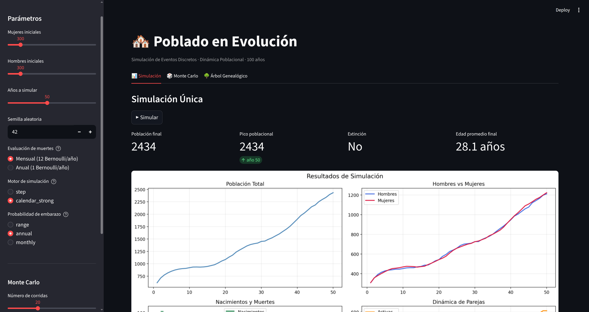

# Sim-City — Poblado en Evolución

Simulación de una dinámica poblacional durante 100 años que modela mortalidad
por rangos de edad, formación y ruptura de parejas, embarazos y nacimientos
múltiples. Incluye análisis Monte Carlo, análisis de sensibilidad y árbol
genealógico.

El proyecto implementa dos enfoques de simulación:

- **Motor mensual (`step`)** — avanza el tiempo en pasos fijos de un mes.
  En cada paso aplica las 7 fases del modelo (envejecimiento, muertes,
  rupturas, soledad, emparejamiento, embarazos y nacimientos) a toda la
  población de forma sincrónica.

- **Motor de calendario de eventos (`calendar_strong`)** — usa una Lista de
  Eventos Futuros (FEL). Cada entidad programa su próximo evento
  individualmente (p.ej. su propia muerte o el nacimiento de un hijo) y el
  motor los procesa en orden cronológico estricto. Esto permite saltar
  directamente al siguiente evento relevante sin iterar meses vacíos,
  reproduciendo con mayor fidelidad la asincronía real de los procesos
  demográficos.

## Requisitos

- Python 3.10+

```bash
pip install -r requirements.txt
```

## Correr con el Dashboard interactivo (Streamlit)

La forma más sencilla de explorar la simulación es con el dashboard interactivo:

```bash
streamlit run app.py
```

Se abrirá automáticamente en `http://localhost:8501`. Desde la barra lateral
puedes ajustar motor, semilla, población inicial, horizonte temporal e
interpretación de probabilidades sin tocar el código.



## Correr desde la línea de comandos

Simulación con parámetros por defecto:

```bash
python main.py
```

Simulación personalizada:

```bash
python main.py --mujeres 500 --hombres 500 --años 100 --seed 42
```

Exportar estadísticas a CSV:

```bash
python main.py --mujeres 500 --hombres 500 --años 100 --seed 42 --csv stats.csv
```

Análisis Monte Carlo (50 réplicas):

```bash
python main.py --mujeres 500 --hombres 500 --años 100 --seed 42 --runs 50
```

Análisis de sensibilidad:

```bash
python main.py --sensitivity
```

Árbol genealógico de la familia más grande:

```bash
python main.py --mujeres 500 --hombres 500 --años 100 --seed 42 --family-tree
```

### Argumentos de `main.py`

| Argumento | Tipo | Default | Descripción |
|---|---|---|---|
| `--mujeres` | int | 500 | Número inicial de mujeres |
| `--hombres` | int | 500 | Número inicial de hombres |
| `--años` | int | 100 | Años a simular |
| `--seed` | int | None | Semilla aleatoria |
| `--sim-mode` | str | `step` | Motor: `step` o `calendar_strong` (FEL) |
| `--death-mode` | str | `monthly` | Evaluación de muerte: `monthly` o `annual` |
| `--runs` | int | — | Activa Monte Carlo con N réplicas |
| `--sensitivity` | flag | — | Ejecuta análisis de sensibilidad |
| `--family-tree` | flag | — | Muestra árbol genealógico |
| `--csv` | str | — | Exporta estadísticas a CSV |
| `--save-fig` | str | — | Guarda gráficas en PNG |
| `--no-plot` | flag | — | No mostrar ni guardar gráficas |

## Funcionamiento del motor mensual

Cada mes ejecuta 7 fases en orden causal fijo:

1. Envejecer a todos (+1 mes)
2. Evaluar muertes (Bernoulli por persona, tasa derivada por rango de edad)
3. Evaluar rupturas (Bernoulli por pareja)
4. Decrementar contadores de soledad
5. Formar parejas (shuffle Fisher-Yates + iteración secuencial)
6. Evaluar embarazos (Bernoulli por mujer en condiciones)
7. Procesar nacimientos (al cumplirse 9 meses de gestación)

Cada 12 meses se registra un snapshot anual con población, nacimientos, muertes,
parejas, distribución etaria y edad promedio.

## Experimentos

Para reproducir los experimentos base del proyecto:

```bash
python main.py --mujeres 100 --hombres 100 --años 100 --seed 0 --no-plot
python main.py --mujeres 500 --hombres 500 --años 100 --seed 42 --no-plot
python main.py --mujeres 1000 --hombres 1000 --años 100 --seed 7 --no-plot
```

## Estructura del proyecto

```text
Sim-City/
├── sim/
│   ├── tables.py                   # Tablas de probabilidades del modelo
│   ├── random_vars.py              # LCG y distribuciones derivadas
│   ├── stats_tools.py              # Chi², KS, IC, t de Welch
│   ├── person.py                   # Entidad Persona
│   ├── couple.py                   # Entidad Pareja
│   ├── simulator.py                # Motor de paso mensual
│   ├── calendar_strong_simulator.py# Motor FEL (lista de eventos futuros)
│   ├── factory.py                  # Selector de motor
│   ├── monte_carlo.py              # Runner de N réplicas
│   ├── sensitivity.py              # Análisis de sensibilidad
│   └── genealogy.py                # Árbol genealógico
├── informe/
│   ├── informe.tex
│   └── figures/
├── app.py                          # Dashboard Streamlit
├── main.py                         # CLI
├── visualize.py                    # Gráficas Matplotlib
├── requirements.txt
└── README.md
```
